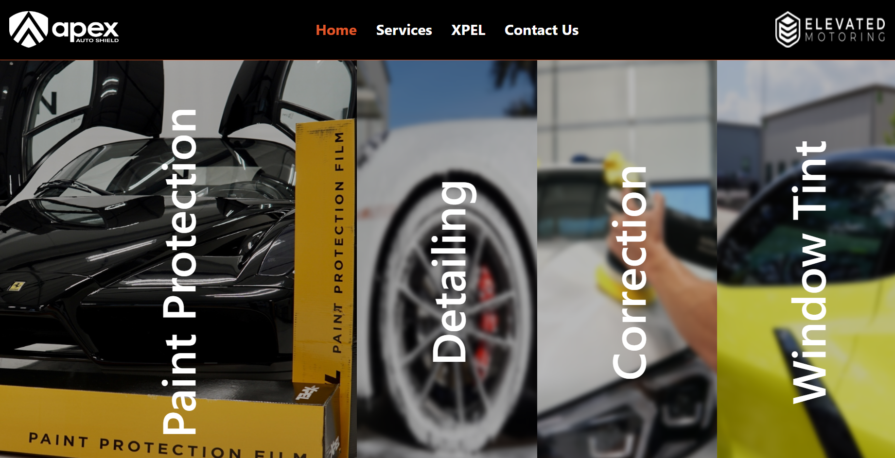
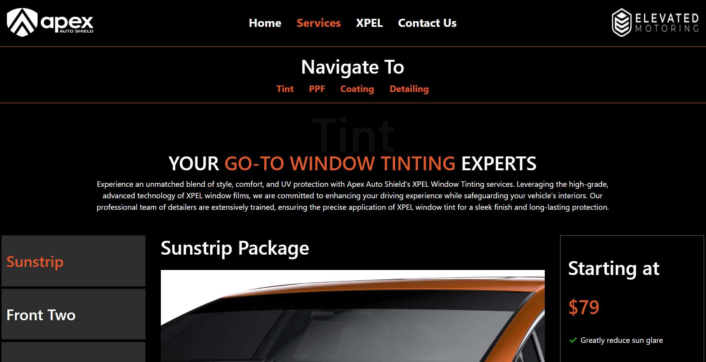
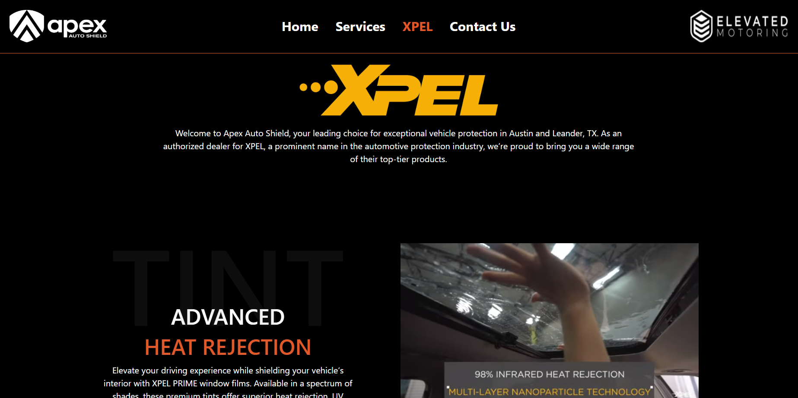

# Apex Auto Shield 

## Project Description
With the help of a UX/UI designer, I used React to redesigned the main website of Apex Auto Shield. This project is hosted on Netlify.

## Table of Contents
[Images](#images)  
[Features](#features)  
[Technologies](#technologies)   
[License](#license)  
[Credits](#credits) 

## Images
  

  

## Features
### React Router
The webpage utilizes React's Browser Router, NavLink, and Outlet to navigate between the pages.

## Technologies
This redesign utilizes a modern tech stack to deliver a seamless user experience:

- *Frontend*: React.js, React Router, HTML, CSS, Javascript
- *Deployment*: Netlify
  
## License
This application uses the [MIT LICENSE](./LICENSE), please refer to the link for more details

## Credits
Please reach out to me with questions or comments.
https://github.com/coldnebraska   
